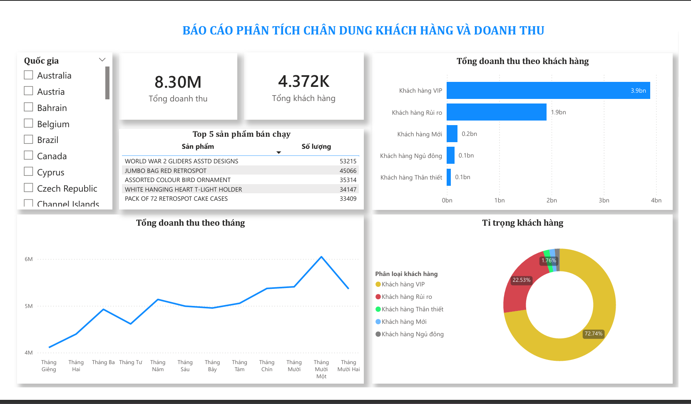

# Online Retail Customer Segmentation (RFM Analysis)

## 📌 Project Overview
This project involves building an automated **Power BI dashboard** to analyze and segment a database of **4,372 unique customers** from a retail dataset. 

The goal is to apply the **RFM (Recency, Frequency, Monetary) model** to identify high-value customer groups and provide actionable insights for marketing and inventory optimization.

## 📊 Key Insights & Features
* **RFM Segmentation:** Successfully categorized 4,372 customers into 5 distinct groups (VIP, Loyal, New, Hibernating, and At Risk) using custom scoring logic.

* **Revenue Impact Analysis:** Discovered that the **VIP segment contributes 72.7% of total revenue** (£8.3M), despite representing a small portion of the total customer base.

* **Product & Trend Visualization:** Identified the **Top 5 best-selling products** and analyzed monthly revenue trends to identify seasonal growth patterns.

* **Interactive KPI Dashboard:** Features dynamic slicers and KPI cards for real-time monitoring of total revenue, order count, and customer distribution.

## 🛠 Technologies Used
* **Power BI Desktop:** Used for end-to-end data modeling and dashboard design.

* **DAX (Data Analysis Expressions):** Engineered complex measures to calculate RFM scores and establish data relationships.

* **Power Query:** Performed extensive data cleaning, including removing duplicates and handling missing values in the transaction records.

## 🖼 Dashboard Preview

*(Note: Upload your screenshot with this filename to your GitHub repository)*.

## 📂 Project Structure
* `RFM_Analysis.pbix`: The primary Power BI file containing the model and reports.
* `Data/`: Sample dataset containing retail transaction records.
* `Images/`: Screenshots of the RFM segmentation charts and revenue reports.
